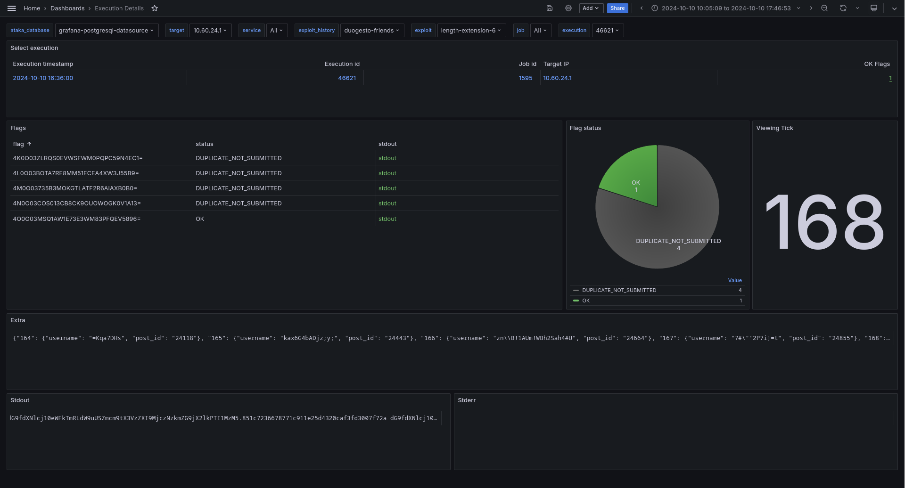

# Grafana Dashboards for Ataka

These are three dashboards intended to get an overview over what your [ataka](https://github.com/openattackdefensetools/ataka) is up to during an Attack-Defense CTF. They might not be pretty and definitely beta, but better than nothing.

## Features

### Overview


* Big Green Numbers, have an overview of total captured flags over time and in the last tick
* Built-in command reference for ataka
* Monitor flag status to spot flake flags, broken exploits or misbehaving submission
* Large Ugly Tables: Inspect captured flags per target X service, over all time and for the last tick
* Basic stats and gauge of exploitable targets per service

### Exploit Details


* Select the service and exploit history you want to inspect
* Timeline of exploitable targets
* Most data from Overview, but selective for one or few exploit histories

### Execution Details



* Select target, service, exploit history as template variables
* Select an execution from the table at the top
* Inspect flags, flag status, extra and output of the execution

Some statistics are only over the selected interval. "Last tick" refers to the last completed tick before the end of the currently viewed interval.

## Setup

The dashboards use the postgres database of ataka directly.

### Optional: create database user

It is recommended though not required to create another user for the database, with read-only permissions.

Replace `$PG_PASSWD` with a password suitable to your needs.

```sh
docker exec -it ataka_postgres_1 psql ataka -U ataka -c "
CREATE USER grafana WITH CONNECTION LIMIT 100 PASSWORD '$PG_PASSWD';
GRANT USAGE ON SCHEMA public TO grafana;
GRANT SELECT ON ALL TABLES IN SCHEMA public TO grafana;
"
```

### Connect the containers

Grafana needs to be able to connect to postgres to fetch data.
If both grafana and ataka are started using a normal `docker compose`, you can use a dedicated network setup like this:

```yaml
# grafana/docker-compose.yml
services:
  grafana:
      # ...
      networks:
      # ...
      - grafana_ataka
# ...
networks:
    # ...
    grafana_ataka: # empty object
```

```yaml
# ataka/docker-compose.yml
services:
  postgres:
      # ...
      networks:
      # ...
      - grafana_ataka
# ...
networks:
  # ...
  grafana_ataka:
    external: true # Use pre-existing network
    name: grafana_grafana_ataka # prefix might differ, use `docker network ls` to find the name
```

With this setup, you have to start grafana to create the network before starting ataka.

### Create the data source

To tell grafana how to talk to ataka, got to `Menu` -> `Connections` -> `Data sources` -> `+ Add new data source` -> `PostgreSQL`.

| Key | Recommended value |
|---|---|
| Host URL | `postgres:5432` if you are using the setup above, whatever host/port you use to connect to postgres from grafana otherwise. |
| Database name | `ataka` for the default ataka setup |
| Username | `grafana`, or whatever username you used for ataka |
| Password | Your `$PG_PASSWD` or your ataka database password |  
| TLS/SSL Mode | `disable` |  

Klick "Save & Test".

### Import the dashboards

There are different ways to import the dashboards.

#### Import using `deploy`

For easier development, I created the [`./deploy`](./deploy) script. To use it for importing, create a grafana access token.
Under `Administration` -> `Users and access` -> `Service accounts`, you can create an editor account with an access token. To import the dashboards to grafana, run

```sh
# Replace https://grafana.example.org with the URL for your grafana instance.
# You will be asked to paste your service account's access token.
# You can instead set `GRAFANA_HOST` and `GRAFANA_TOKEN` env vars.
./deploy import --host https://grafana.example.org
```

That should create the dashboards in the root folder.

#### Import by pasting JSON

You can also transform the dashboard files for manual import in grafana:

```sh
./deploy -d overview print
./deploy -d execution print
./deploy -d exploit print
```

Or, if you don't trust my script:

```sh
yq ".dashboard" dashboards/overview.yaml
yq ".dashboard" dashboards/exploit.yaml
yq ".dashboard" dashboards/execution.yaml
```

or use any other yaml parser of your choice. Paste the `.dashboard` element into grafana.

## Why YAML?

I decided to use yaml to represent the dashboards in this repo mostly for readability and multiline strings.
I can edit the SQL queries for all dashboards comfortably in a normal text editor now, instead of struggling with escaped newlines in JSON.

While other formats might be better suited, yaml was the first that came in mind, so deal with it or create a PR.

## Customization

The `deploy` script does more than just import three dashboards. It can also `export` them from grafana to yaml files, so you can edit them both in the grafana web UI and in the yaml files, though not simultaneously (merging is not implemented).

Use `./deploy -d <dashboard> <action> ...` to only act upon one of the dashboards. Especially useful for `print`.

Use `./deploy set <key> <value>` to set variables and config for all dashboards. Currently supported keys are:

* `./deploy set ctf_start YYYY-MM-DDThh:mm:ss.000Z`: Sets the `ctf_start` variable, mostly used for the current tick number.
* `./deploy set tick_time <spec>`: Sets the `tick_time` variable, used for calculating the current and last tick and aggregating many data points into the tick they happened. Examples: `1m`, `90s`.
* `./deploy set refresh <spec>`: Sets default refresh interval for all dashboards. Examples: `30s`, `1m`.
* `./deploy set time-from <spec>`: Sets default start of shown interval for all dashboards. Examples: `now-6h`, but can also be an absolute date.
* `./deploy set time-to <spec>`: Same as `time-from`, but for the end of the interval. Examples: `now`.
